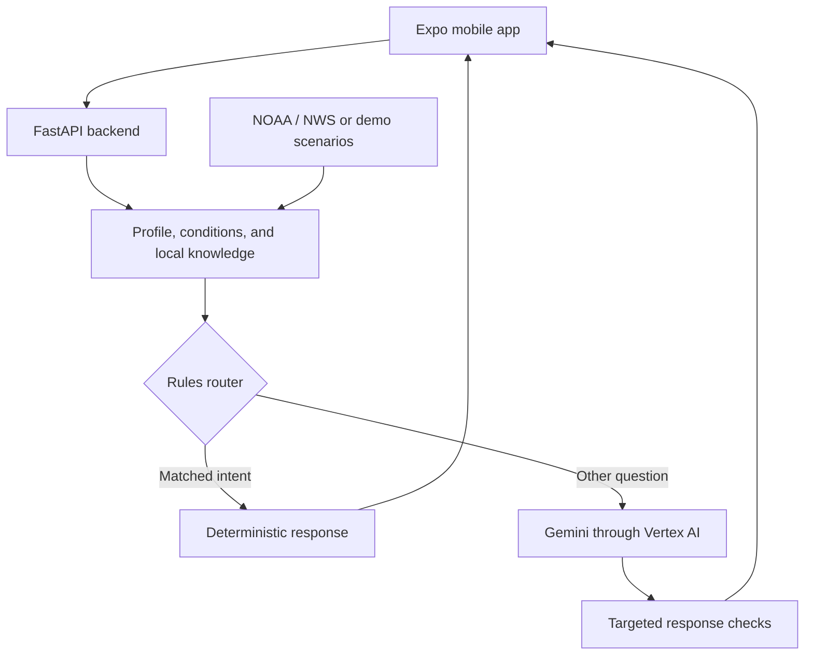

# FloodSafe Norfolk

**A mobile flood-information companion designed around access and functional needs.**

FloodSafe Norfolk is a research-driven product prototype for helping residents understand flood conditions and plan around mobility, transportation, communication, caregiving, and equipment needs. Its design draws on focus-group requirements and combines a mobile interface with deterministic response rules, contextual AI explanations, and checks on generated replies.

**Status:** prototype under development. Scenario demonstrations are implemented; operational validation and a public demo are pending.

[Architecture](docs/architecture.md) · [Engineering decisions](docs/engineering.md) · [Feature status](docs/feature-status.md) · [Evaluation](docs/evaluation.md) · [Demo plan](demo/README.md)

## The problem

A flood alert does not answer every practical question a resident faces. The useful next step may depend on access to transport, reliance on powered equipment, responsibility for someone else, or how information needs to be presented. A caregiver and a community coordinator can need different explanations of the same conditions.

FloodSafe explores how to connect community conditions with those functional needs while keeping emergency handling and selected response boundaries explicit in code.

## Product experience

| Area | Current prototype |
| --- | --- |
| Today | Four condition flags, before/during/after guidance, and scenario controls |
| Companion | Rules-first answers and contextual AI responses for questions not handled by rules |
| Resources | A categorized directory covering healthcare, pharmacies, shelters, transport, and equipment charging |
| Accessibility | Read-aloud controls, adjustable text size, visual status cues, and accessibility labels |
| My Map | A schematic street view illustrating scenario-dependent road status |
| Buddies / My People | Proposed support-network interactions demonstrated through local UI state |

The resource directory, map, and buddy interactions are demonstrations. They do not establish actual facility availability, safe routes, or delivered notifications.

## Engineering scope

This project brings together several layers of application engineering:

- **Mobile development:** an Expo/React Native interface with navigation, asynchronous API calls, chat history, and scenario selection.
- **Accessible interaction:** speech output, adjustable typography, labeled controls, and information organized around practical resident needs.
- **Backend design:** FastAPI endpoints for conditions, personas, community resources, and chat.
- **External data integration:** connectors for NWS alerts and NOAA tide predictions at Sewells Point.
- **AI orchestration:** a rules router before Gemini generation, assembled context, bounded conversation history, and targeted response checks afterward.
- **Data modeling:** separate representations of functional needs, community conditions, local knowledge, and resource categories.
- **Testable behavior:** regression test definitions for routing, response overrides, and resource-directory logic.

The [engineering notes](docs/engineering.md) explain the decisions and trade-offs behind these components.

## Architecture

**Stack:** Python, FastAPI, Pydantic, HTTPX, Gemini through Vertex AI, React Native, Expo, Expo Speech, and pytest test definitions.

The AI currently receives assembled structured context. A vector database, document-retrieval pipeline, trained flood forecast model, and production deployment are not part of the inspected implementation.

## Development direction

The next milestones are reliable separation of live and simulated information, explicit unavailable-data states, reviewed demonstration scenarios, and usability evaluation. Later extensions include authoritative facility and road-status feeds, a flood-model interface, real support-network notifications, and stronger offline support. See [feature status and roadmap](docs/feature-status.md).

## Demonstration and source

A public demo link and recordings are not available yet. The [demonstration plan](demo/README.md) describes what a scenario walkthrough will show. Only synthetic profiles and clearly labeled simulated conditions will be used in the public showcase.

Application source and internal configuration remain private. This repository documents the product and its engineering. FloodSafe is a research prototype, not an operational emergency information or navigation service.
